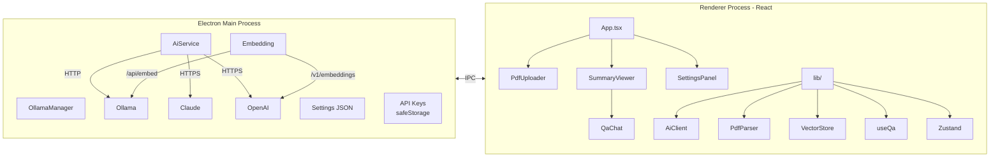
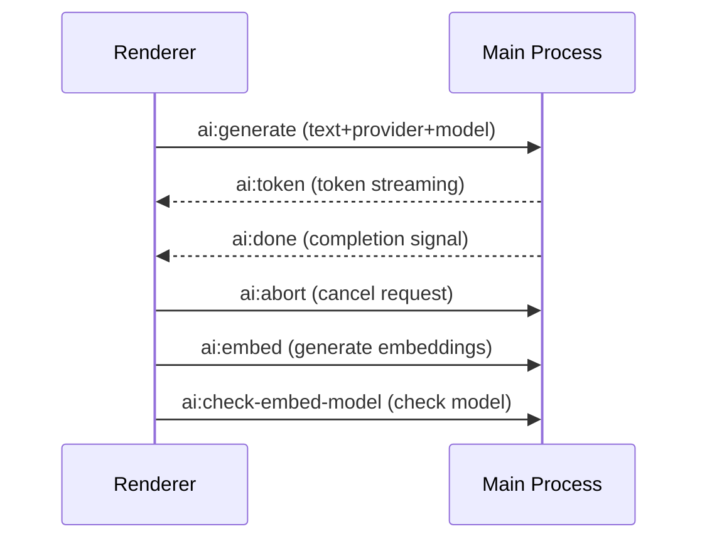

[한국어](README.md) | 🌐 **English**

# 📄 Local AI PDF Analyzer

**A local AI-powered PDF summarization tool that runs entirely on your PC.**

Unlike cloud-based AI summarization services that require uploading PDFs to external servers, this app runs **AI directly on your computer**.

- **Fully offline** — Ollama local AI engine runs on your PC; PDF files are never sent to external servers
- **Text + image analysis** — Analyzes text, charts, diagrams, and tables in any PDF using Vision AI
- **Scanned PDF OCR** — Vision AI recognizes text page-by-page even in image-based scanned PDFs
- **RAG-based Q&A chat** — Embedding vector semantic search finds the most relevant parts of your PDF to answer questions accurately
- **Safe for sensitive documents** — Exam materials, internal documents, draft papers — summarize with confidence
- **Korean/English UI** — Switch app interface language in Settings
- **Paid AI available** — Switch to Claude or OpenAI API for higher quality when needed

---

## Download & Install

> **[Download Latest Version](https://github.com/wpdlf/local-pdf-analyzer/releases/latest)**

1. Download `PDF.Setup.x.x.x.exe` from the link above
2. Run the downloaded file to install
3. Launch the app from the desktop shortcut or Start menu
4. On first launch, the AI engine (Ollama), Korean-specialized models (gemma3, exaone3.5), and RAG embedding model (nomic-embed-text) are installed automatically — follow the on-screen instructions

> **Note**: AI model downloads require approximately 8GB of disk space and a few minutes.

## How to Use

### 1. Upload PDF
- **Drag and drop** a PDF file onto the app window, or
- Click the **Select file** button, or
- Press **Ctrl+O** to open the file dialog

### 2. Choose Summary Type

| Type | Description |
|------|-------------|
| **Full summary** | Summarize the entire PDF as one document |
| **By chapter** | Summarize each chapter/section separately |
| **Keywords** | Extract key terms with descriptions in a table |

### 3. View & Save Results
- Summary appears in real-time as it streams
- Save with the **Export .md** button
- Copy to clipboard with the **Copy** button

### 4. Q&A Chat (RAG Semantic Search)
- A **RAG vector index** is automatically built when a PDF is loaded (progress shown in header)
- When the **RAG** badge appears in the header, semantic search is active
- Ask questions and the AI finds the most relevant parts of the PDF using embedding vector similarity
- Falls back to keyword-based search automatically if no embedding model is available
- Maintains context across up to 10 conversation turns
- `Enter`: send / `Shift+Enter`: new line

> **Embedding model**: `nomic-embed-text` (274MB) is auto-installed during first-run setup. OpenAI users automatically get `text-embedding-3-small`.

## AI Provider Selection

The default is local AI (Ollama). Switch to paid AI for higher quality summaries.

| Provider | Features | Cost |
|----------|----------|------|
| **Ollama (default)** | Offline use, data privacy | Free |
| **Claude API** | High summary quality, strong with long documents | Paid (per token) |
| **OpenAI API** | GPT-4o based, general-purpose | Paid (per token) |

### Q&A Embedding Models (RAG)

| Provider | Embedding Model | Dimensions | Notes |
|----------|----------------|------------|-------|
| **Ollama** | nomic-embed-text (274MB) | 768 | Local, auto-installed on first run |
| **OpenAI** | text-embedding-3-small | 1536 | Auto-used with API key, no extra install |
| **Claude** | Ollama fallback | — | No native embedding API; tries Ollama, falls back to keyword search |

> Q&A works with keyword-based search even without an embedding model. RAG is an optional accuracy enhancement.

To use paid AI:
1. Settings (gear icon) -> Select Claude or OpenAI under AI Provider
2. Enter and **Save** your API key (keys are encrypted and stored locally)
3. Select a model and **Save settings**

## PDF Image Analysis

Vision AI automatically analyzes charts, diagrams, tables, and photos embedded in PDFs.

- Images are extracted per page and analyzed with Vision models
- Analysis results are integrated into page text for improved summary quality
- PDFs without images are summarized as text-only
- Can be toggled on/off in Settings

| Provider | Vision Model | Notes |
|----------|-------------|-------|
| **Ollama** | llava, llama3.2-vision | Local, prompted to install if missing |
| **Claude** | claude-sonnet-4 | API costs apply |
| **OpenAI** | gpt-4o | API costs apply |

> Ollama requires a Vision model (e.g., llava). Install via Settings -> Model Management.

## Scanned PDF OCR

Vision AI automatically recognizes text page-by-page in image-based/scanned PDFs.

- Auto-enters OCR fallback when text extraction fails (toggleable in Settings)
- Renders each page as image -> requests text extraction from Vision model
- Batch parallel processing (3 pages at a time) with progress bar
- Auto-cancels OCR when loading a different file
- Documents processed via OCR show an `OCR` badge

| Provider | Korean OCR Accuracy | Notes |
|----------|-------------------|-------|
| **Claude** | 90-98% | Includes table/formula structure, API costs |
| **OpenAI (GPT-4o)** | 90-95% | Includes table/formula structure, API costs |
| **Ollama (llava)** | 60-75% | Free, suitable for simple English PDFs |

> Processing time and API costs increase with page count. For 50 pages: Claude ~$0.15-0.30, GPT-4o ~$0.25-0.50.

## Key Features

- **Local AI** — Summarize offline with Ollama; PDFs never leave your PC
- **RAG Q&A chat** — Semantic search with embedding vectors finds relevant content; keyword fallback supported (10-turn conversation)
- **Clean summaries** — Unwanted greetings, compliments, and conversational phrases removed via prompt constraints + post-processing filter
- **Image analysis** — Charts/diagrams/tables analyzed by Vision AI and integrated into summaries
- **Scanned PDF OCR** — Text recognition via Vision AI for image-based PDFs (toggleable)
- **Korean optimized** — Improved Korean PDF text extraction, auto-adjusted chunk sizes by Korean character ratio
- **Auto model install** — First run auto-downloads gemma3, exaone3.5 (Korean models) + nomic-embed-text (RAG embedding)
- **Paid AI support** — Claude API and OpenAI API for high-quality summaries (works without Ollama)
- **API key security** — OS keychain encryption + decrypted only in Main process (never exposed to Renderer)
- **Data privacy** — PDFs never sent to external servers when using Ollama
- **Real-time streaming** — Summary appears as it generates with auto-scroll (pauses when you scroll up)
- **Cancellable** — Stop summarization anytime; 5-minute timeout auto-abort
- **Dark mode** — Light/Dark/System theme in Settings
- **Multilingual UI** — Korean/English app interface toggle (Settings -> Language)
- **Large PDF support** — Long documents auto-split into chunks for batch processing with integrated summary
- **Persistent settings** — Settings saved across app restarts

## System Requirements

- Windows 10 or later
- Minimum 8GB disk space (for AI models, when using Ollama)
- Internet connection (for first install and paid API usage)

## Troubleshooting

| Issue | Solution |
|-------|----------|
| Ollama install fails | Install manually from [ollama.com](https://ollama.com), or click "Use other AI Provider" for Claude/OpenAI |
| Poor Korean summary quality | Check that gemma3 or exaone3.5 is selected in Settings |
| Slow summarization | Switch to a lighter model (e.g., phi3) or reduce chunk size |
| Cannot extract PDF text | Enable "Scanned PDF OCR" in Settings. Requires Vision model (llava, Claude, GPT-4o) |
| Inaccurate OCR | Ollama llava has limited Korean accuracy. Switch to Claude or OpenAI for much better results |
| Image analysis not working | Ollama requires a Vision model (llava, etc.). Install via Settings |
| API key error | Verify API key in Settings. Claude: `sk-ant-...`, OpenAI: `sk-...` |
| Claude/OpenAI unavailable | Save your API key first, then select the Provider |
| Unwanted phrases in summary | v0.10.0+ includes prompt hardening + post-processing filter for auto-removal |
| Q&A can't answer | If no RAG badge, install embedding model: `ollama pull nomic-embed-text`. In keyword mode, include specific terms |
| RAG indexing not working | Complete first-run setup (nomic-embed-text auto-installs). Manual: `ollama pull nomic-embed-text` |

---

## Developer Guide

### Tech Stack

| Item | Technology |
|------|-----------|
| Framework | Electron 34 + React 19 |
| Language | TypeScript (strict mode) |
| AI Generation | Ollama (local) / Claude API / OpenAI API — Main process IPC |
| AI Embedding (RAG) | Ollama /api/embed / OpenAI /v1/embeddings — In-memory vector store |
| PDF Parsing | pdfjs-dist (position-based text extraction + image extraction, Korean optimized) |
| State Management | Zustand |
| Styling | Tailwind CSS v4 + @tailwindcss/typography |
| Build | electron-vite + electron-builder (NSIS) |
| Testing | Vitest (19 unit tests) |
| i18n | Custom (i18n.ts) — 180+ keys, useT() hook, template interpolation |
| API Key Security | Electron safeStorage (OS keychain encryption), decrypted only in Main process |

### Development Setup

```bash
# Install dependencies
npm install

# Development mode
npm run dev

# Production build
npm run build

# Package installer
npm run package

# Run tests
npm test

# Tests (watch mode)
npm run test:watch
```

### Project Structure

```
src/
├── main/                 # Electron main process
│   ├── index.ts          # App entry, IPC, settings/API key management
│   ├── ai-service.ts     # AI API calls (streaming summary + Vision image analysis + OCR)
│   └── ollama-manager.ts # Ollama install/start/model management
├── preload/
│   └── index.ts          # contextBridge API (ai, settings, apiKey, ollama, file)
└── renderer/             # React UI
    ├── App.tsx            # Root component, summarization logic
    ├── components/        # UI components (9)
    ├── lib/
    │   ├── ai-client.ts       # AI Client (IPC requests to Main for summary/Q&A)
    │   ├── pdf-parser.ts      # PDF text + image extraction, chapter detection, OCR fallback
    │   ├── chunker.ts         # Text chunk splitting (auto Korean ratio detection)
    │   ├── i18n.ts            # Internationalization (180+ keys, t() function, useT() hook)
    │   ├── use-qa.ts          # Q&A chat hook (RAG semantic search + keyword fallback, conversation history)
    │   ├── vector-store.ts    # In-memory vector store (cosine similarity search, dimension validation)
    │   ├── store.ts           # Zustand state management (summary + Q&A + RAG index)
    │   └── __tests__/         # Unit tests (19)
    └── types/
        └── index.ts       # Type definitions + Provider model constants
```

### Architecture

AI API calls are made from the Main process for API key security. The Renderer requests summaries via IPC and receives token streams.



#### IPC Channels



### Data Processing Pipeline

The full pipeline from PDF file to summary output:

```mermaid
flowchart TD
  PDF[/"📄 PDF File"/]

  subgraph S1["1. PDF Parsing"]
    P1["pdfjs-dist text extraction<br/>Position-based spacing"]
    P2["Image extraction<br/>JPEG base64, max 1024px"]
    P3["Auto chapter detection<br/>Chapter 1 / 제1장 patterns"]
  end

  subgraph S1B["1-b. OCR Fallback (scanned PDFs)"]
    O1["Page → JPEG rendering<br/>Auto scale, max 3000px"]
    O2["Batch 3 pages Vision OCR"]
  end

  subgraph S2["2. Image Analysis (optional)"]
    I1["Vision model preflight check"]
    I2["Batch 3 images → text insertion"]
  end

  subgraph S3["3. Text Chunking"]
    C1["Korean ratio detection<br/>100% Korean: 1.5 chars/token<br/>0% Korean: 4.0 chars/token"]
    C2["Split at paragraph boundaries"]
  end

  subgraph S4["4. AI Summary Generation"]
    A1["Prompt: system instructions + rules"]
    A2["Ollama / Claude / OpenAI<br/>HTTP streaming"]
    A3["Multi-chunk → integrated summary"]
  end

  subgraph S5["5. Result Display"]
    R1["Token buffering 50ms"]
    R2["Markdown rendering"]
    R3["Conversational text auto-removal"]
    R4["Export .md / Copy"]
  end

  subgraph S6A["6-a. RAG Index Build"]
    RA1["Detect embedding model<br/>nomic-embed-text / OpenAI"]
    RA2["Overlap chunking 500 tokens"]
    RA3["Batch embed 50 at a time<br/>NaN/Infinity validation"]
    RA4["Vector store<br/>Dimension lock"]
  end

  subgraph S6B["6-b. Q&A Chat"]
    QB1["Embed question"]
    QB2["Cosine similarity Top-5 search"]
    QB3["RAG fail → keyword fallback"]
    QB4["Prompt assembly + streaming answer"]
  end

  PDF --> S1
  S1 -->|"< 50 chars extracted"| S1B
  S1 --> S2
  S1B --> S2
  S2 --> S3
  S3 --> S4
  S4 --> S5
  PDF -.->|"On document load"| S6A
  S6A --> S6B
### Security Design

| Threat | Mitigation |
|--------|-----------|
| API key theft | `safeStorage` (OS keychain) encryption, keys never sent to Renderer |
| Ollama SSRF | localhost only (`validateOllamaUrl`), http/https only |
| PDF drop path manipulation | `will-navigate` blocked, `file://` + `.pdf` extension only |
| IPC input manipulation | Type/range/length validation on all IPC handlers |
| External URL opening | Allowed domain whitelist (ollama.com, anthropic.com, openai.com, github.com) |
| Markdown XSS | `javascript:`, `data:` URLs blocked, external images blocked |
| Response size overflow | Streaming 50MB, Vision 10MB, model list 1MB limits |
| Q&A prompt injection | `splitPrompt` uses first separator only, `sanitizePromptInput` on both RAG/keyword contexts |
| RAG embedding corruption | NaN/Infinity validation at IPC boundary, dimension lock (first chunk), array count mismatch rejection |
| RAG document mixing | buildId guard + final docId verification cancels previous builds on document switch |
| OCR prompt injection | Vision/OCR prompts explicitly ignore image instructions, response URL/code block removal |
| OCR memory overflow | Auto page scale reduction, 3000px cap, OffscreenCanvas GPU immediate release |
| Q&A history overflow | History 4000 char limit + 10-turn FIFO, question 1000 char cap |

## License

MIT License. See [LICENSE](LICENSE) for details.
